# The Shrinking Edge

[](https://github.com/takakhoo/prediction-market-research-agent/actions/workflows/offline.yml)

**Most of the edge you can measure in a prediction market disappears when you try to trade it. This repo measures how much is left, on 1,009,373 resolved Polymarket markets and \$97 billion of volume.**

A Polymarket price is read as a probability, so every gap between price and outcome looks like a trading rule. We rebuilt 23.7 million real fills, priced tens of thousands of contracts as options on the asset underneath them, trained models walk-forward, asked language models, and then sent every apparent edge down the same ladder: prices that traded, estimators that are fair when prices are fair, older information, limited capital, fees, and a confirmation period fixed in advance.


*One real Bitcoin contract, picked by a fixed rule (among contracts whose spot crossed the strike in the last 36 hours, the one where the option-model rule staked the most). Top: Binance spot against the strike. Bottom: blue dots are actual Polymarket fills, and the orange line is what a textbook digital-option formula says Yes is worth, using only spot and trailing volatility from one minute earlier. The two track each other for a day and a half. Where they part, late on, the rule sided with the formula and lost \$48,777: on this contract the market was right.*

**[Open the live explorer](https://takakhoo.github.io/prediction-market-research-agent/)**: scrub through this contract fill by fill, bend the formula's volatility and the rule's threshold, price your own contract, and hover the ladder for every interval. It runs in the browser from the committed sample and result tables.

> **Status (2 Oct 2026).** Everything below is measured and regenerates from this repository. Fills cover a stratified sample of 48,193 markets out of 1,009,373; the rest of the trade download is the next thing to run. Nothing here is investment advice and the repo places no orders.

## Headline

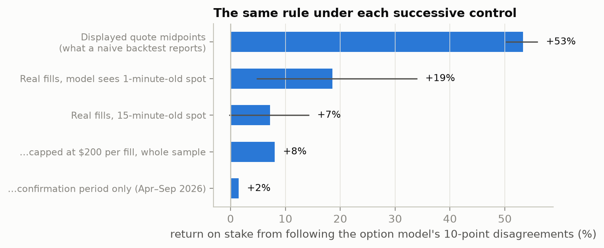

One rule, "take the side the option model prefers when it disagrees with the price by ten cents", scored five ways on crypto threshold contracts:

| How it is scored | Return on stake |
|---|---|
| At displayed prices, the way a quick backtest would | +53% (+50 to +56) |
| At fills that happened, model sees 1-minute-old spot, after fees | **+18.6% (+4.7 to +34.0)** |
| Same, model sees 15-minute-old spot | +7.2% (-0.3 to +14.3) |
| Capped at \$200 per fill, 15-minute-old spot, whole sample | +8.1% (Sharpe 1.33, t = 1.76 on daily returns, deflated Sharpe probability 0.38) |
| Confirmation period, April to September 2026 | +1.5% (t = 0.33) |

What we found, in order of how sure we are:

- **Displayed prices lie where nobody trades.** 32% of price-history snapshots have had no trade in a day. Their midpoints sit near 0.5 and resolve Yes 14 points less often than shown. That is the famous "Yes bias", and most of it cannot be traded.
- **The favorite-longshot bias has whatever sign your estimator gives it.** On the same fills, pooling says Yes prices of 0.8 to 0.9 are too low by 6.5 (3.9 to 8.6) points. One bet per market at the first fill in that band says they are too high by 11.3 (10.1 to 12.4) points.
- **A textbook option formula knows as much as the price.** On crypto threshold contracts the best forecast puts weight 0.52 on the fill price and 0.60 (0.39 to 0.69) on the formula. Takers who trade against the formula by ten cents lose 10.2% (1.9 to 18.2).
- **That edge is a speed race, and it is closing.** It shrinks as the formula's data ages (+7.2% (-0.3 to +14.3) with 15-minute-old spot), and it shrank when fees arrived: endorsed fills returned +2.6% (-17.9 to +18.8) in 2026Q3.
- **A learned model beats the price, modestly.** Trained walk-forward on 36,398 test markets, a boosted residual model with order-flow, wallet, and option-value features improves the Brier score of the last traded price by +1.87% (+2.19% on the last five months). On price-linked contracts the bare formula beats the displayed quote by +10.9%.
- **The standard fixes do not.** Platt and isotonic recalibration lose to the raw price out of time. Sorting wallets by past return does not sort their future return. Claude Fable 5.1, Sonnet, and Haiku with no retrieval score 0.236, 0.235, and 0.246 against the market's 0.153 on 282 questions opened after their training cutoffs.
- **First prints overshoot, in tiny size.** The first fill of a market inside a high price band is about eleven points too high. Buying No at the next real fill returned +15.5% (+10.8 to +20.0) after fees, on fills with a median stake of \$5.

Paper: [`paper/main.pdf`](paper/main.pdf). Every number above is in [`results/tables/`](results/tables/).

**Target venue: ACM EC 2027** (ACM Conference on Economics and Computation; 18 pages single column, double-blind), with KDD 2027 as the backup. The EC 2027 call is not out yet, so the early-February deadline is an estimate from last year, and the draft uses the EC 2026 style kit. Why this venue and what the others require: [`paper/VENUES.md`](paper/VENUES.md).

## Contents

- [What it does](#what-it-does)
- [How it works](#how-it-works)
- [The science, step by step](#the-science-step-by-step)
- [Against prior work](#against-prior-work)
- [What it means for stocks and investing](#what-it-means-for-stocks-and-investing)
- [Try it](#try-it)
- [The monitoring application](#the-monitoring-application)
- [What happened to v1](#what-happened-to-v1)
- [Reproduce](#reproduce)
- [Layout](#layout)
- [Scope](#scope)

## What it does

Three things, in the order you would use them.

1. **It rebuilds the market.** Collectors pull every resolved Polymarket market, its rules and fee schedule, its quote history, and its fill-by-fill trade record with wallets, plus the spot and volatility data for anything a contract settles on. No credentials, no paid data.
2. **It prices what can be priced.** A contract like "Bitcoin above \$103,000 at noon" or "NVDA closes above \$180 on Friday" is an option. The repo values each one from the underlying at every fill, so there is a second opinion to hold the market price against.
3. **It audits edges.** Calibration gaps, maker and taker returns, recalibration, learned models, wallet records, language models, and the option formula all go through the same controls, and each result says which control it survived and which one removed it.

If you are coming from stocks: it is a worked example of the checks a claimed trading edge should pass before anyone believes it, run on a market where the full trade record happens to be public.

## How it works

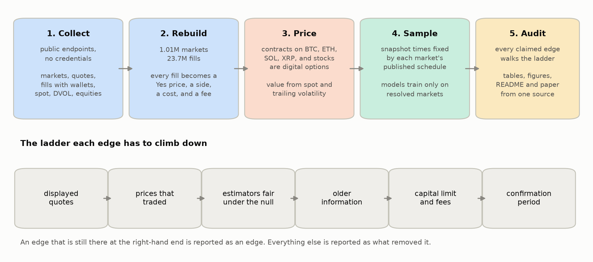

1. **Collect.** Market metadata by keyset pagination over monthly partitions, quote midpoints at one-minute to twelve-hour resolution depending on lifetime, taker fills with wallets, Binance one-minute candles, Deribit DVOL, and hourly and daily equity bars. Every collector is restartable ([`research/collect/`](research/collect/)).
2. **Rebuild.** Each fill becomes a Yes price, a taker side, a cost, a fee, and a realized result. The same pass computes, for every fill, the taker wallet's record on markets that had already resolved at that moment ([`build_tape.py`](research/experiments/build_tape.py), [`trades.py`](research/lib/trades.py)).
3. **Price.** Question text is parsed into option terms (asset, strike, kind, settlement instant), and the settlement rule is replayed on spot data to check the parse against Polymarket's official outcome ([`contracts.py`](research/lib/contracts.py), [`vol.py`](research/lib/vol.py), [`stocks.py`](research/lib/stocks.py)).
4. **Sample.** Snapshot times come from each market's published schedule, so no sampling decision can see the outcome. Models are tested walk-forward and only ever train on markets that had resolved ([`panel.py`](research/lib/panel.py), [`walkforward.py`](research/lib/walkforward.py)).
5. **Audit.** Each experiment writes one JSON table. Figures, this README, and the paper's numbers are rendered from those tables by one script, so prose cannot drift from results ([`facts.py`](research/facts.py), [`figures.py`](research/figures.py)).

## The science, step by step

### 1. What a fill is

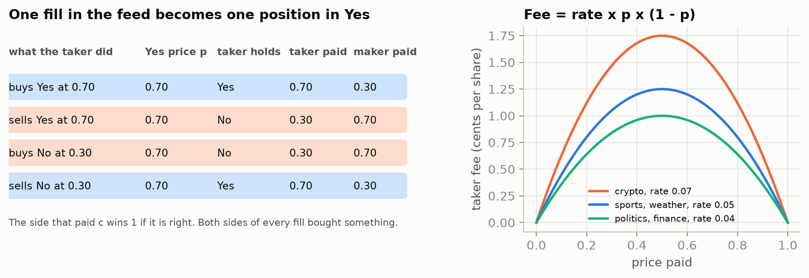

Every market has two tokens, Yes and No, that pay \$1 or \$0. The public feed reports each taker fill as a side, a token, a price $q$, and a size. Buying No at $q$ is the same position as selling Yes at ${1-q}$, so every fill reduces to a Yes price $p$, a direction $d$ ($+1$ if the taker ends long Yes), and a cost per share for the side the taker bought:

$$c = \begin{cases} p & d = +1 \\ 1-p & d = -1 \end{cases}$$

The maker holds the other side at ${1-c}$. With outcome $y \in \{0,1\}$, the taker's side wins $w = y$ if $d=+1$ and ${1-y}$ otherwise. Polymarket charges takers a fee per share of

$$f = \rho\, c\,(1-c)$$

with rate $\rho$ between 0.03 and 0.07 by category, so the fee peaks at 1.75 cents for a crypto contract at 50 cents. The return on a set of fills $F$ with sizes $n_i$ is dollars won over dollars staked:

$$R(F) = \frac{\sum_{i \in F} n_i\,(w_i - c_i - f_i)}{\sum_{i \in F} n_i\, c_i}$$

Confidence intervals resample whole events (all markets on one underlying question), or expiry dates for price-linked contracts, because fills inside one event share one outcome.

### 2. A third of displayed prices are parked

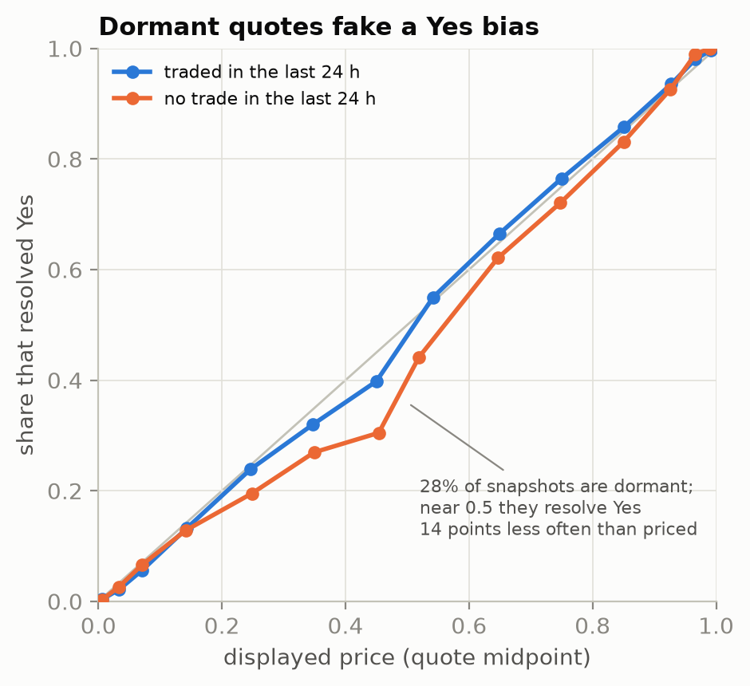

Polymarket's price history is a quote midpoint. A book with a bid at one cent and an ask at 99 cents has a midpoint of 0.50. 38% of dormant snapshots (no trade in the prior 24 hours) sit between 0.4 and 0.6, against 14% of active ones, and in ordinary Yes/No markets they resolve Yes 14 points less often than displayed. Active snapshots are off by 7 points. Any calibration curve or backtest built on the price-history endpoint inherits this.

Everything after this section uses prices that traded.

### 3. Same fills, opposite answers

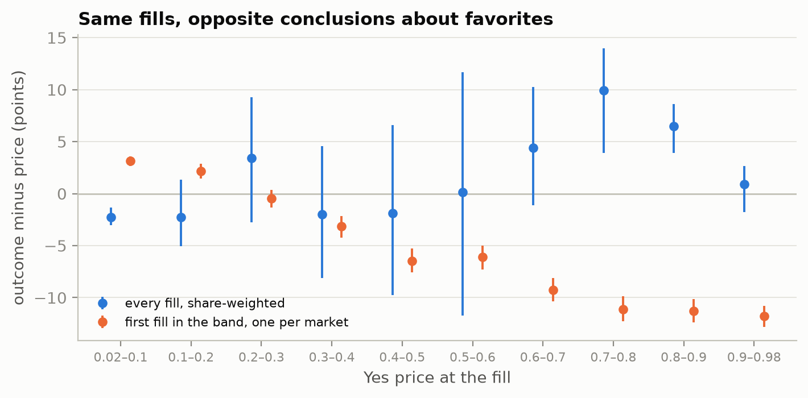

If fill prices are fair, then $\mathbb{E}[y - p] = 0$ under any rule that picks fills using only the past. Two such rules disagree in sign:

$$\hat\Delta_{\text{pooled}} = \frac{\sum_i n_i\,(y_i - p_i)}{\sum_i n_i} \qquad\qquad \hat\Delta_{\text{first}} = \frac{1}{M}\sum_{m=1}^{M} \left(y_m - p_{m,\text{first}}\right)$$

- **Pooled** takes every fill in a price band, weighted by shares. A market counts in proportion to how much it trades inside the band, and volume piles up where a contract is on its way to resolving.
- **First touch** takes one fill per market, the first inside the band. It is a stopping rule, so its expectation is exactly zero when prices are fair.

A third common choice averages each market's own return ratio. That one is biased upward even when prices are fair: a market whose early favorite loses also collects winning fills once the other side becomes the favorite, which dilutes its losses. We do not use it.

Buying the favorite at its first fill between 0.70 and 0.85 returned -2.65% (-3.25 to -2.03) across 31,956 markets, and -3.80% (-4.18 to -3.40) between 0.85 and 0.95.

### 4. One market, up close

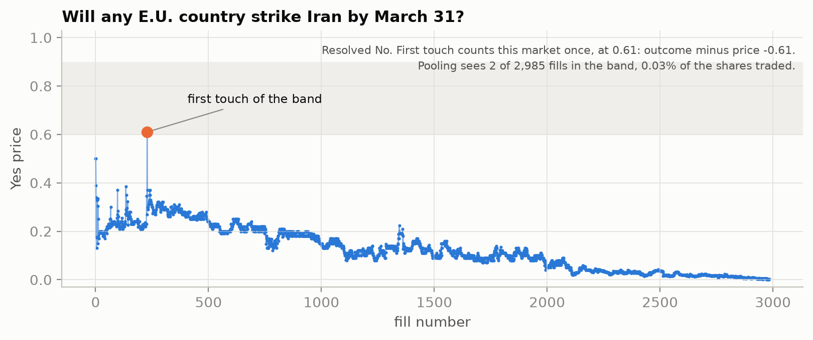

One real market from the tape, picked by rule (among Yes/No markets with 300 to 3,000 fills whose first touch of the 0.6 to 0.9 band came after at least 20 fills and was undone by the next five, the one with the most fills). The orange point is one order that paid 0.61 for a contract trading near 0.25 a moment before and a moment after. The first-touch estimator counts this market once, at that price. The pooled estimator barely sees it, because almost none of the market's volume traded inside the grey band. 30% of first touches look like this one: a single order sweeps a thin book and pays 45 (42 to 48) points too much.

### 5. Calibration, and who wins

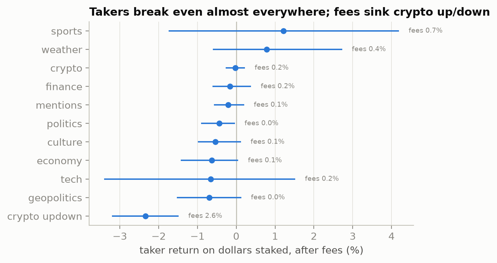

Calibration is summarized by the slope $b$ in

$$\Pr(y = 1) = \sigma\!\left(a + b \cdot \operatorname{logit} p\right)$$

where $b > 1$ means prices are not extreme enough (the classic favorite-longshot bias) and $b < 1$ means they are too extreme. At scheduled snapshots, last-trade slopes are below one: sports 0.85 (0.79 to 0.90), politics 0.93 (0.87 to 0.99), weather 0.75 (0.63 to 0.89). They rise from 0.79 in the first 15% of a market's life to 0.96 in the last quarter. Early prints are noisy, and the noise looks like overconfidence.

Across \$2.83 billion of taker stake, takers earned -0.27% (-0.61 to +0.09) after fees. There is no aggregate maker-taker transfer of the kind reported on Kalshi. The exception is the 5-minute and 15-minute crypto up/down contracts, where takers lose 2.34% (1.49 to 3.20) and fees take 2.63% of stake.

### 6. An event contract is a digital option

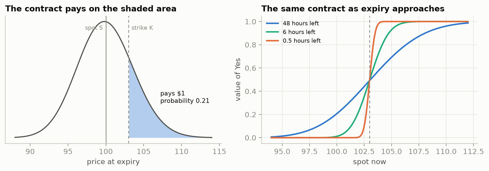

"Will Bitcoin be above \$103,000 at noon?" pays one dollar or nothing. That is a cash-or-nothing call. With spot $S$, strike $K$, time left $\tau$ in years, and annualized volatility $\sigma$, a driftless lognormal model values Yes at

$$\hat p = \Phi(d_2), \qquad d_2 = \frac{\ln(S/K) - \tfrac{1}{2}\sigma^2\tau}{\sigma\sqrt{\tau}}$$

The other contract families follow from it:

| Contract | Value |
|---|---|
| Above $K$ | $\Phi(d_2(K))$ |
| Below $K$ | ${1 - \Phi(d_2(K))}$ |
| Between $K_1$ and $K_2$ | $\Phi(d_2(K_1)) - \Phi(d_2(K_2))$ |
| Up or down over a window | $\Phi(d_2(S_{\text{open}}))$, struck at the window's opening price |
| Reaches $K$ before expiry | $\Phi\left(\frac{-b - v^2/2}{v}\right) + e^{-b}\,\Phi\left(\frac{-b + v^2/2}{v}\right)$ with $b = \ln(K/S)$, $v = \sigma\sqrt{\tau}$ (reflection principle) |

Inputs, all known before the fill: $S$ is the close of the last one-minute candle that had finished. $\sigma$ is realized volatility over a trailing window about four times the remaining horizon, floored at one hour. $\tau$ runs to the settlement instant read from the contract's own rules. Nothing is fitted.

For single stocks the clock is trading time. With 20-day close-to-close volatility $\sigma_d$, the variance left until the close at $T$ is

$$V(t, T) = \sigma_d^2 \left[ 0.25\, N_{\text{overnight}}(t, T) + 0.75\, \frac{\text{session time left}(t, T)}{6.5\text{ h}} \right]$$

so each remaining overnight gap carries a quarter of a day's variance and each session the other three quarters, and $\hat p = \Phi\big((\ln(S/K) - V/2)/\sqrt{V}\big)$.

Replaying each contract's settlement rule on the underlying data reproduces Polymarket's official outcome for 99.97% of Binance-settled crypto threshold contracts and 99.9% of single-stock contracts. Settlement times are read from each contract's rules: the API's end time is wrong for about 3% of threshold contracts, by up to 16 hours.

### 7. One contract, up close

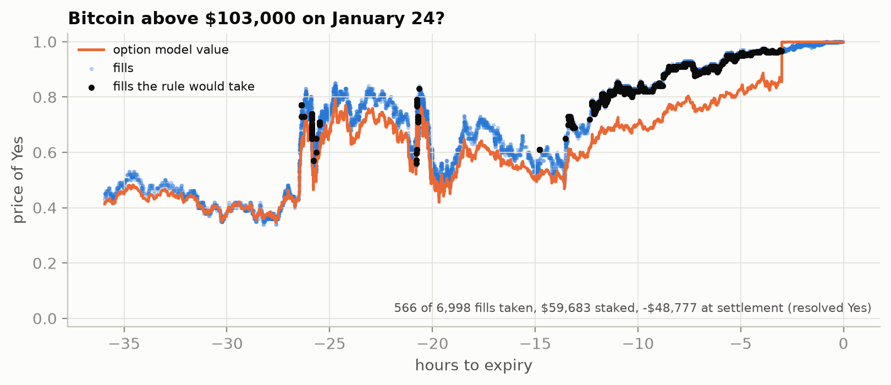

The contract from the animation at the top. Orange is $\Phi(d_2)$ recomputed at every fill. Black points are fills where the side the taker bought was worth at least ten cents more than its price plus the fee:

$$\text{edge}_i = \big(\text{model value of the side bought}\big) - c_i - f_i > 0.10$$

That inequality is the whole trading rule. On this contract it took 566 of 6,998 fills, staked \$59,683, and lost \$48,777 when the contract resolved Yes. Four of those fills bought Yes a day out and won. The other 562 bought No, with a median of nine hours left, while a volatility spike from the day before was still inside the formula's trailing window: it valued Yes around 0.65, the market paid 0.78, and the market was right. The trailing-window volatility is the formula's weakest input, and this is what that weakness costs. The rule earns its average across thousands of contracts with losses like this one inside it. [Try it](#try-it) prints every input behind any of these fills.

### 8. The formula against the fill price

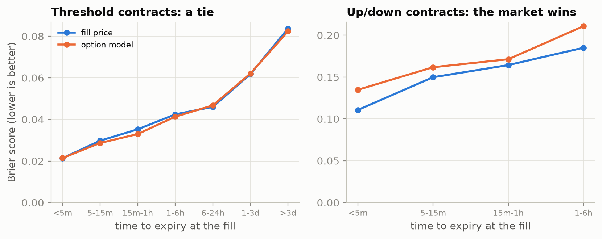

Both forecasts are scored at the same fills with the Brier score $(\hat p - y)^2$, one weight per market. On 9,612 threshold contracts the formula and the fill price are tied at every horizon. To ask whether each knows something the other does not, fit

$$\Pr(y = 1) = \sigma\!\left(a + w_{\text{price}} \operatorname{logit} p + w_{\text{model}} \operatorname{logit} \hat p\right)$$

If the price already contained the formula, $w_{\text{model}}$ would be zero. It is 0.60 (0.39 to 0.69), next to 0.52 on the price. On the short up/down contracts it is 0.07 (-0.03 to 0.20): that market already knows everything the formula does.

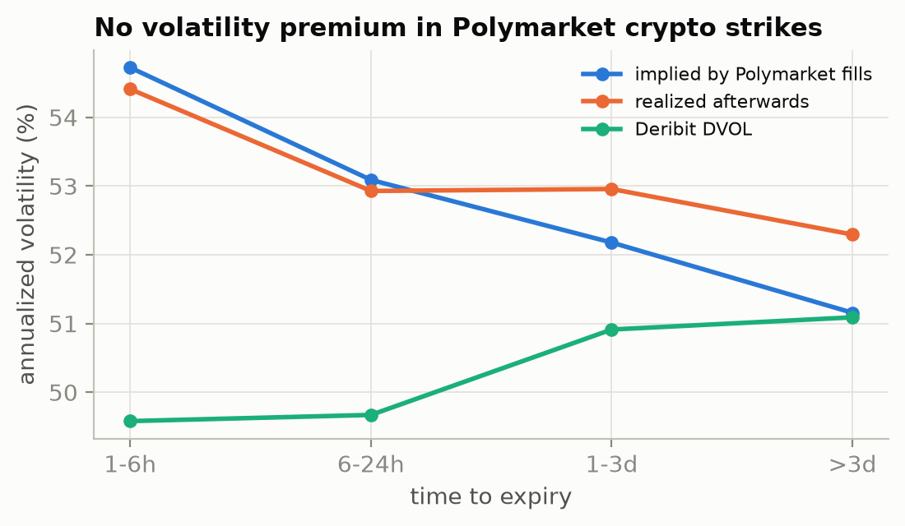

Solving $\Phi(d_2(\sigma)) = p$ for $\sigma$ at each fill gives the volatility Polymarket is pricing. It lands within 0.97 to 0.99 of what was realized between the fill and expiry. Listed options usually charge a premium over realized volatility. These contracts do not.

The same construction on 2,694 contracts on NVDA, TSLA, AAPL, and other single-stock closes gives the formula weight 0.37 (0.27 to 0.50). Takers who trade against it by ten cents lose 23.2% (13.2 to 32.1).

### 9. The edge, and how it fades

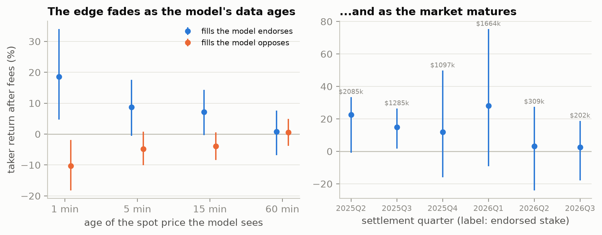

Fills the formula endorses returned +18.6% (+4.7 to +34.0) to the taker after fees; fills it opposes returned -10.2% (-18.2 to -1.9). Give the formula older spot data and the edge shrinks: +8.7% (-0.6 to +17.6) at 5 minutes, +7.2% (-0.3 to +14.3) at 15, +0.8% (-6.9 to +7.6) at 60. Most of it is a speed race. At 5 and 15 minutes the estimate is still positive but its interval reaches zero, and at an hour nothing is left.

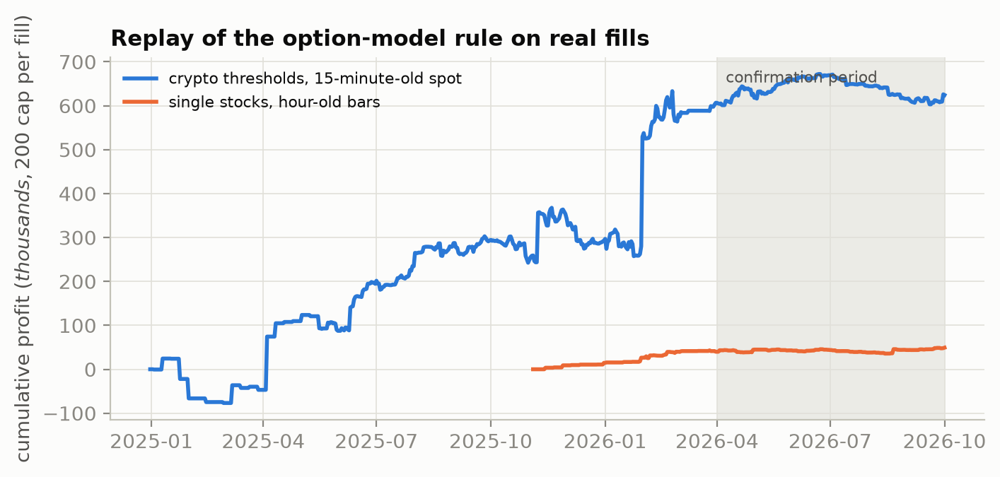

A capital-constrained replay (15-minute-old data, \$200 per fill, profit booked at expiry) made \$624 thousand on at most \$379 thousand deployed. Daily returns are profit over the largest stake outstanding on any day. On that series the Sharpe ratio is 1.33 with t = 1.76: the pooled fill-level interval excludes zero, the day-by-day series does not. Because we looked at 24 variants (thresholds, data ages, sides), the Sharpe ratio is deflated against the best of 24 skill-free strategies:

$$\text{DSR} = \Phi\left(\frac{(\widehat{SR} - SR_0)\sqrt{T-1}}{\sqrt{1 - \hat\gamma_3\,\widehat{SR} + \tfrac{\hat\gamma_4 - 1}{4}\,\widehat{SR}^2}}\right)$$

where $SR_0$ is the expected maximum Sharpe of those 24, and $\hat\gamma_3$, $\hat\gamma_4$ are the skewness and kurtosis of daily returns. It comes to 0.38.

The ten-cent threshold was set on contracts expiring before April 2026. After that the rule returned +1.5%, as a 7% crypto fee rate reached every contract and the stake clearing the bar fell by a factor of five or more.

The single-stock version is smaller and cleaner: +15.5% on stake with at most \$43 thousand deployed, Sharpe 2.53, deflated Sharpe probability 0.72, and +7.9% in the confirmation period.

### 10. Can anything else beat the price?

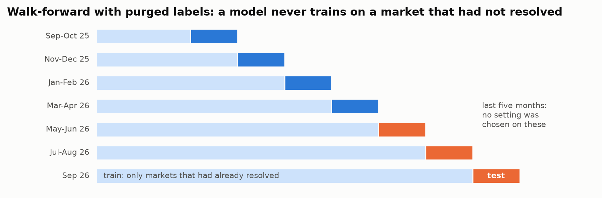

Every challenger is tested on two-month blocks. A model tested in a block trains only on snapshots from markets that had resolved before the block began, so each training label was public when the forecast is made. The learned model predicts the residual, so with no signal it returns the price:

$$\hat p = p + g(x), \qquad g \text{ fit by boosted trees to } y - p$$

with features $x$ from the price path, order flow, the records of the wallets trading, and the option value where one exists.

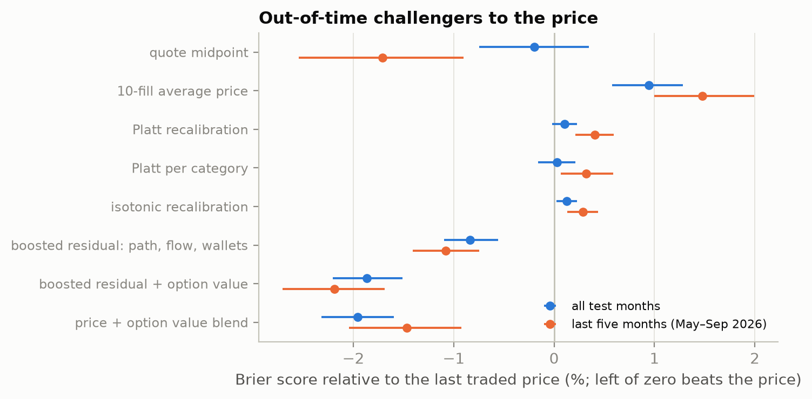

36,398 test markets, last-trade Brier 0.1124. Positive is better than the price.

| Challenger | Brier skill vs price, all months | Last five months (May to Sep 2026) |
|---|---|---|
| Quote midpoint | +0.20% | +1.71% |
| Platt recalibration | -0.11% | -0.41% |
| Isotonic recalibration | -0.13% | -0.29% |
| Boosted residual model: path, flow, wallet records | +0.84% | +1.08% |
| Boosted residual model plus option value | +1.87% | +2.19% |
| Price and option value, two-parameter blend | +1.96% | +1.47% |

Both feature families help, and the option value helps most: on the 13,357 price-linked test markets the two-parameter blend improves on the last trade by +8.3% and on the quote midpoint by +11.5%. No setting was chosen on the last five months, but we did see scores for these configurations on those months on an earlier, smaller tape, so treat that column as a late-period check and not a pristine holdout.

Wallet records: fills by wallets with no resolved history returned -1.14% (-2.07 to -0.05); seasoned wallets returned +0.55% (+0.17 to +0.98). Sorting seasoned wallets by past return does not sort their future return in this sample, which covers only part of each wallet's history.

### 11. Language models

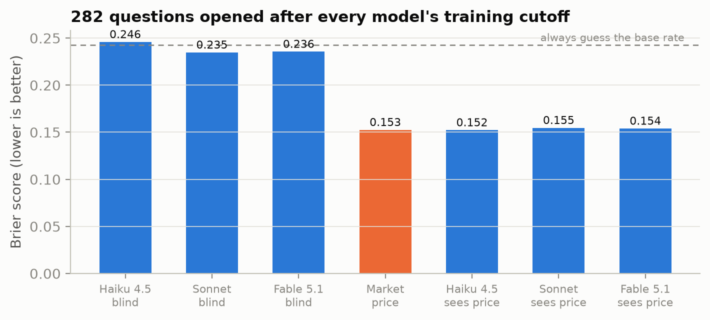

282 Yes/No markets that opened after 10 July 2026, one per event, ten categories. The forecast date is 30% of the way through each market's scheduled life, and the market price at that instant is the benchmark. Each model gets the question, the resolution rules, and the date, with no tools and no retrieval. Blind, all three are close to always guessing the base rate (0.243). Shown the market price, they return it almost unchanged, and their weight next to the price in the regression of section 8 is indistinguishable from zero.

### 12. First prints overshoot

The first fill of a market inside a Yes-price band of 0.8 to 0.9 is 11.3 (10.1 to 12.4) points above the outcome frequency. To trade that, you need a later price. Buying No at the next fill where a taker bought No, at least a minute later and only if the price is still within five cents of the band (median wait 73 minutes), returned +15.5% (+10.8 to +20.0) for the 0.6 to 0.8 band and +23.4% (+15.4 to +31.9) for 0.8 to 0.98, after fees. From April 2026 on: +16.7% (+10.7 to +22.8) and +31.8% (+20.7 to +43.7). Dropping the trigger and simply taking each market's first No-buying fill in the same price range returned +17.5% (+14.1 to +20.9) and +38.3% (+31.7 to +45.5), so the result does not depend on reacting to the first print.

The catch is size. The fills this rule copies have a median stake of \$5, and \$176 thousand in total across both bands. It describes thin books early in a market's life and has almost no capacity.

## Against prior work

Reported findings are as their authors state them; the references are in [`paper/refs.bib`](paper/refs.bib) and notes on each in [`paper/literature_notes.md`](paper/literature_notes.md).

| Prior finding | Here |
|---|---|
| Takers lose to makers on Kalshi (Becker 2026; Bürgi, Deng, Whelan 2026) | No aggregate transfer on Polymarket: takers -0.27% (-0.61 to +0.09). Takers lose where fees are heaviest. |
| Political prices are compressed toward 50% (Le 2026) | At scheduled snapshots of traded prices, slopes are at or below one, politics 0.93 (0.87 to 0.99). Pooled fills do show underpriced favorites; the two samplings disagree. |
| The longshot loss changes sign when contracts are grouped by event (Cardozo and Rivero-Wildemauwe 2026) | Same mechanism, measured directly: pooled and first-touch estimators give opposite signs. |
| A small share of accounts stays skilled out of sample (Gomez-Cram et al. 2026) | Past return does not sort future return on our sample of markets. Wallet features still help the learned model a little. |
| Language models match the market's Brier score (Prophet Arena; Halawi et al. 2024) | Without retrieval they match the base rate, and with the price in the prompt they return the price. |
| Polymarket Bitcoin thresholds sit several points from option-implied values, on three markets (Portnaya 2026) | 9,612 contracts: the formula and the fill price tie in accuracy and each adds to the other. |

## What it means for stocks and investing

This project started as a prediction-market tool. The parts that transfer:

1. **A quote is evidence only if someone could trade it.** The largest "bias" in this dataset came from prices nobody could hit. The same applies to stale closes in thin stocks, wide option quotes, and any backtest on mid prices.
2. **Price the derivative from the underlying first.** A threshold contract on NVDA or Bitcoin has a model price from spot and volatility. When the market and that price disagreed by a wide margin, the market was wrong more often on average, and section 7 shows a contract where it was right. That is the same check an options trader runs against implied volatility.
3. **Ask how an estimate could be executed.** Pooled averages and one-bet-per-market rules gave opposite signs here. A number that does not come with an executable rule is a description, and it may flip.
4. **Edges decay, and fees move first.** The option-model rule was worth about 17% per dollar staked until a fee of at most 1.75 cents a share arrived.
5. **Size matters.** The rule never deployed more than \$379 thousand. Returns on that scale do not carry to a large account.

## Try it

Price one real contract by hand. No downloads, no credentials:

```bash
python -m venv .venv && source .venv/bin/activate
pip install -r requirements-research.txt
python -m research.walkthrough
```

```
=== Bitcoin above $103,000 on January 24? ===
strike 103,000, settles 2025-01-24 17:00 UTC on the Binance 1-minute close

  hours left      spot   sigma   model   fill   side   edge   rule
       35.94   102,002   78.0%   0.413  0.430   No  +0.017   .
       29.44   102,168   78.1%   0.420  0.420   No  -0.000   .
       26.37   104,359   78.4%   0.611  0.770   No  +0.159   take
       26.31   104,909   78.5%   0.657  0.726   No  +0.068   .
       25.64   103,582   79.9%   0.543  0.600   Yes -0.057   .
       23.99   105,139   80.5%   0.680  0.740   Yes -0.060   .
       20.81   103,875   81.1%   0.577  0.580   No  +0.003   .
       20.14   103,847   84.1%   0.573  0.600   Yes -0.027   .
       18.47   104,311   84.6%   0.620  0.690   Yes -0.070   .
       14.76   103,232  101.6%   0.513  0.560   No  +0.047   .
       13.26   104,176  102.8%   0.604  0.720   No  +0.116   take
       10.96   105,151  102.9%   0.709  0.830   No  +0.121   take
       10.93   104,970  102.9%   0.693  0.830   No  +0.137   take
        9.31   104,736  102.7%   0.685  0.820   No  +0.135   take
        7.23   105,088  102.8%   0.747  0.880   No  +0.133   take
        6.47   105,220  102.6%   0.774  0.920   Yes -0.146   .
        5.29   105,252  102.2%   0.802  0.930   No  +0.128   take
        3.07   105,209  101.8%   0.865  0.966   No  +0.101   take
        3.01   105,088  101.7%   0.854  0.965   No  +0.111   take
        0.03   105,765   56.7%   0.999  0.999   No  +0.000   .

Resolved Yes.
  6,998 fills in the last 36 hours; the rule would have taken 566 of them
  $59,683 staked, -$48,777 at settlement (-81.7%)
  largest gap between this recomputation and the pipeline's stored value: 0.0000
```

The last line is a check: the walkthrough recomputes every model value from the committed spot series and compares it with what the full pipeline stored.

Every number behind one fill (this is the largest one the rule took):

```bash
python -m research.walkthrough --fill 2942
```

```
Fill 2942 at 2025-01-23 20:13:48 UTC
  the taker bought 8,680 shares of Yes and paid 0.573 each (Yes price 0.573)
  spot, last closed minute        S = 105,434.00
  strike                          K = 103,000
  time left                     tau = 20.77 hours
  trailing vol (168h window)  sigma = 82.5% a year
  d2 = (ln(S/K) - sigma^2 tau / 2) / (sigma sqrt(tau)) = +0.561
  model value of Yes        N(d2) = 0.713
  model value of what was bought  = 0.713
  fee                             = 0.0000
  edge = value - cost - fee       = +0.140   (take it, bar is +0.10)
  at settlement this fill made    = +$3,708.05 on $4,971.85
```

Run the research tests (pricing identities, fee math, look-ahead guards):

```bash
python -m pytest tests/research -q
```

Regenerate the figures and this README from the committed result tables (charts that need the raw pulls are skipped without them):

```bash
python -m research.figures
```

```bash
python -m research.facts
```

Score the committed language-model forecasts against the market:

```bash
python -m research.experiments.e8_llm
```

## The monitoring application

The original application in `src/` finds markets where local news may be evidence, discovers Telegram channels, and classifies messages for human review. It stops at review and does not trade. Its setup guide moved to [`docs/LIVE_SETUP.md`](docs/LIVE_SETUP.md). The credential-free check still works:

```bash
pip install -r requirements-offline.txt
python -m pytest -q --ignore=tests/research
python scripts/offline_replay.py
```

## What happened to v1

The first paper built on this application ([agent-evidence-evaluation](https://github.com/takakhoo/agent-evidence-evaluation)) reported a 5.8-hour news lead time and a 58% reduction in review load. The lead times came from randomly generated timestamps and the review-load number from a confounded comparison. Both were withdrawn. This version starts from the other end: measured outcomes on real markets, with each claim tested against the price a trader could have had.

The same habit caught four problems inside this project before they reached a table: the parked midpoints of section 2, the biased per-market ratio of section 3, an option-model "win" over the market that existed only at displayed prices, and a batch of contracts whose listed end time was 16 hours before the candle their rules settle on, which made the option model look sharper than it was.

## Reproduce

The raw pulls are about 4 GB and take a few hours at the public rate limits:

```bash
python -m research.collect.markets
python -m research.collect.build_universe
python -m research.collect.prices
python -m research.collect.crypto
python -m research.collect.stocks
python -m research.collect.trades --ids research/data/derived/trade_ids.parquet
```

Then every table and figure:

```bash
./research/run_all.sh
```

| Step | Script | Table |
|---|---|---|
| Fill tape and snapshot panel | `research/experiments/build_tape.py` | `research/data/derived/` |
| Dormant midpoints, calibration | `e1_e2_calibration.py` | `results/tables/e1_e2_calibration.json` |
| Makers, takers, fees | `e3_maker_taker.py` | `e3_maker_taker.json` |
| Pooled, first touch, fade | `e3b_first_touch.py` | `e3b_first_touch.json` |
| Crypto contracts as options | `e4_crypto_options.py` | `e4_crypto_options.json` |
| Walk-forward model comparison | `e5_model.py` | `e5_model.json` |
| Capital-constrained replay | `e6_backtest.py` | `e6_backtest.json` |
| Wallet records | `e7_wallets.py` | `e7_wallets.json` |
| Language models | `e8_llm.py` | `e8_llm.json` |
| Single-stock contracts as options | `e9_stock_options.py` | `e9_stock_options.json` |

## Layout

- [`research/collect/`](research/collect/): restartable collectors for markets, quotes, fills, crypto spot and DVOL, equity bars
- [`research/lib/`](research/lib/): contract parsing and settlement replay, option pricing, fill conversion and fees, snapshot panel, walk-forward models, bootstrap
- [`research/experiments/`](research/experiments/): one script per table
- [`research/figures.py`](research/figures.py), [`research/diagrams.py`](research/diagrams.py), [`research/render_demo.py`](research/render_demo.py): every image on this page
- [`research/walkthrough.py`](research/walkthrough.py): the offline contract walkthrough
- [`docs/`](docs/): the live explorer page (static HTML, served by GitHub Pages) and the application setup guide
- [`research/facts.py`](research/facts.py): renders this README and `paper/numbers.tex` from the tables
- [`results/`](results/): tables, figures, and the walkthrough sample
- [`paper/`](paper/): draft in the ACM EC style (`cd paper && tectonic main.tex`), references, literature notes, venue notes
- [`src/`](src/), [`scripts/`](scripts/), [`configs/`](configs/), [`sql/`](sql/): the original monitoring application
- [`tests/`](tests/): application tests and research tests

## Scope

- Fills are a stratified sample of 48,193 markets, so wallet histories are partial and wallet-level results are weak.
- The trade feed shows the taker side only, and we see fills, not order books. Fill sizes bound what each rule could have traded.
- The formula's volatility is a trailing window chosen by a fixed rule. It lags after a spike (section 7) and nothing about it was tuned.
- Stock inputs are hourly bars with no extended-hours data. Contracts settled on Chainlink streams are modeled with Binance prices.
- The confirmation period is six months.
- Language-model forecasts came from subagents instructed to use no tools; every run made exactly the file reads and one write the protocol required.
- Reference details in the literature notes were verified to exist; quoted figures should be rechecked against the PDFs before submission.

This repository has no license grant and is provided for research review.

## Credits

Market, quote, and trade data: Polymarket's public Gamma, CLOB, and data APIs. Spot: Binance public market data. Implied volatility: Deribit DVOL. Equity bars: Yahoo Finance chart API. Paper style: ACM `acmart` with the EC 2026 kit. Language-model forecasts: Claude Fable 5.1, Sonnet, and Haiku 4.5.
