# Telegram Channel Discovery Workflow

This is the current backtest-oriented workflow for market-to-channel discovery.

## Mermaid Flow

```mermaid
flowchart LR
    A[Markets] -- scrape --> B((Selected Market / Event))

    B -- AI local-edge review --> B1[Local market decision]
    B1 -- AI keyword planning --> C["Multilingual keywords + official handles"]

    C --> D[Google search for official t.me links]
    D -- extract links --> E["Official channels"]
    E -- AI relevance check --> F[Accepted seed channels]

    F --> G["Depth-1 similar channels"]
    G -- AI relevance check + dedupe --> H["Depth-1 accepted"]

    H --> I["Depth-2 similar channels"]
    I -- AI relevance check + dedupe --> J["Final candidate pool"]

    J --> K[Per-channel step review in backtest UI]
    K --> L[Final selected channels for market mapping]
```

## Current Constraints

1. Backtest can cap reviewed channels (default 20) for step-by-step inspection.
2. Minimum channel members filter is configurable (default currently 25,000 for backtest UI).
3. Similar expansion is bounded by seed count and per-seed limits.
4. Dedupe is applied across search + similar stages before final selection.

## What The Backtest UI Shows

1. Local-classifier prompt and output.
2. Query-planner prompt and output.
3. Search and similar stage summaries.
4. Per-query and per-seed channel decision traces.
5. Per-channel review prompt, model output, recent messages, and decision.
6. Final selected channel list.

